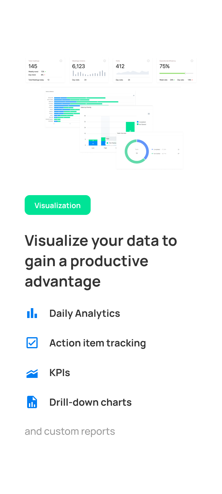
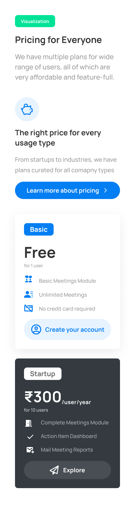
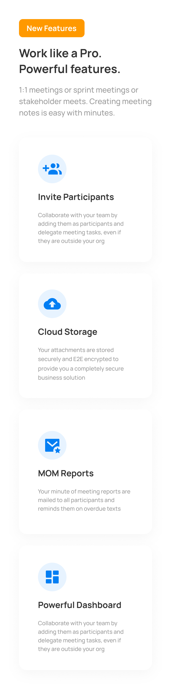

# Tandemloop Screening Test Assignment

## Design Tool used

- Figma

## Style Guide

### Colors used

- `#4ED199`
- `#FF9900`
- `#037EF3`
- `#343A40`

### Font and Typeface used

- Manrope Medium
- Manrope Bold

## Outputs

